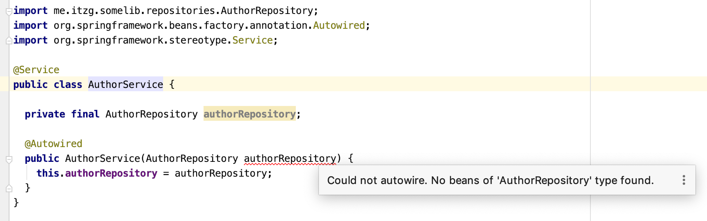

This repo demonstrates an issue in IntelliJ IDEA 2019.3.1 where the repository component scanning does not get detected when `@EnableJpaRepositories` is specified on a composed `@Configuration` annotation, such as:

```java
@Target(ElementType.TYPE)
@Retention(RetentionPolicy.RUNTIME)
@Configuration
@EntityScan("me.itzg.somelib.entities")
@EnableJpaRepositories("me.itzg.somelib.repositories")
public @interface EnableExtraJpa {

}
```

Even with the JPA repositories specified as such, the autowiring of a repository is reported as missing:



### IntelliJ version details

```
IntelliJ IDEA 2019.3.1 (Ultimate Edition)
Build #IU-193.5662.53, built on December 17, 2019
Runtime version: 11.0.5+10-b520.17 x86_64
VM: OpenJDK 64-Bit Server VM by JetBrains s.r.o
macOS 10.14.6
Registry: 
Non-Bundled Plugins: IvyIDEA, Karma, Lombook Plugin, MavenRunHelper, PlantUML integration, Pythonid, String Manipulation, YAML/Ansible support, artsiomch.cmake, claims.bold.intellij.avro, com.dmarcotte.handlebars, org.jetbrains.plugins.go-template, org.jetbrains.plugins.go, com.google.gct.core, com.intellij.kubernetes, com.perl5, com.robohorse.robopojogenerator, io.protostuff.protostuff-jetbrains-plugin, jms-messenger, name.kropp.intellij.makefile, net.sjrx.intellij.plugins.systemdunitfiles, org.intellij.RegexpTester, org.intellij.plugins.hcl, org.intellij.plugins.tickscript, org.intellij.scala, org.jetbrains.plugins.ruby, org.nik.presentation-assistant, org.plugin.dot.id, org.toml.lang, ru.adelf.idea.dotenv
```